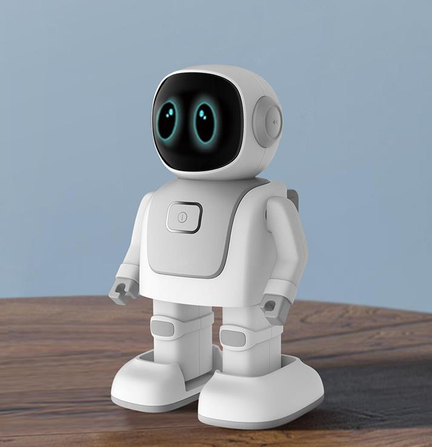

# Razah

Razah is a Open-Source software package for Humanoid Robots. It provides support for verbal and visual application. Motive of this repo is to reducing the build time of software.

## Table of content

- [Disclaimer](#disclaimer)
- [Getting Started](#getting-started)
    - [Requirement](#requirement)
    - [Installation](#installation)
    - [Demo](#demo)
- [Contribution](#contribution)
- [License](#license)
- [Links](#links)


## Disclaimer
**Note:** Razah package only supports Python3.8 and above.

## Getting Started
### Requirement
Package requires:
  - Python3.8 (recommended)
  - ROS Noetic (recommended)
  - Ubuntu Desktop (recommended)
  - Gazebo or Pybullet Simulator

### Installation
```bash
sudo apt install espeak python-pyaudio python3-pyaudio libasound-dev portaudio19-dev libportaudio2 libportaudiocpp0 ffmpeg libav-tools
```
```bash
git clone https://github.com/fxrarz/razah.git
cd razah
pip install -r requirement.txt
```

### Demo
```bash
roslaunch razah razah.launch
```

## Contribution
Fast and accurate processing modules are required. This include Verbal & Visual modules.
- Verbal:
  - Text-to-speech
  - Speech-to-text
  - Voice recognition
  - Chatbot
- Visual
  - Image classification
  - Object Detection
  - Image Segmentation

## License
The Razah package is licensed under the terms of the GPL Open Source
license and is available for free.

## Links
* [Ubuntu desktop](https://ubuntu.com/download/desktop)
* [Python3.8](https://linuxize.com/post/how-to-install-python-3-8-on-ubuntu-18-04/)
* [ROS Noetic](http://wiki.ros.org/noetic/Installation/Ubuntu)
* [Pybullet](https://pypi.org/project/pybullet/)
